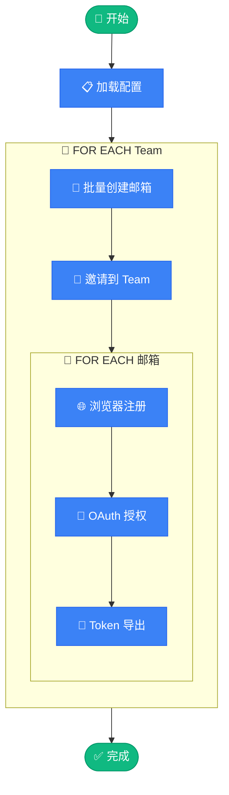

# 🚀 OpenAI Team Auto Provisioner

<div align="center">

**OpenAI Team 账号自动批量注册 & Token 导出工具**

[](https://www.python.org/)
[](https://drissionpage.cn/)
[](LICENSE)

</div>

---

## ✨ 功能特性

- 🔄 **全自动化流程** - 从邮箱创建到 Token 导出一键完成
- 📧 **多邮箱系统支持** - 支持 Cloud Mail、GPTMail、MoeMail 三种邮箱服务
- 👥 **Team 批量邀请** - 一次性邀请多个账号到 Team
- 🌐 **浏览器自动化** - 基于 DrissionPage 的智能注册
- 🔐 **本地 OAuth 授权** - 完全本地化的 Codex OAuth 流程，无需外部服务
- 💾 **Token 导出** - 导出 JSON 格式 Token，兼容 CLIProxyAPI
- 📊 **状态追踪** - 详细的账号状态记录与追踪
- 🌍 **代理轮换** - 支持多代理配置和自动轮换
- 🎭 **浏览器指纹** - 随机浏览器指纹防检测

---

## 📋 前置要求

- Python 3.12+
- [uv](https://github.com/astral-sh/uv) (推荐) 或 pip
- Chrome 浏览器
- 邮箱服务 (Cloud Mail / GPTMail / MoeMail 任选其一)

---

## 🛠️ 快速开始

### 1. 安装依赖

```bash
# 使用 uv (推荐)
uv sync

# 或使用 pip
pip install -r requirements.txt
```

### 2. 配置文件

```bash
# 复制配置模板
cp config.toml.example config.toml
cp team.json.example team.json
```

### 3. 编辑配置

#### `config.toml` - 主配置文件

```toml
# 邮箱系统选择: "cloudmail" / "gptmail" / "moemail"
email_provider = "moemail"

# Cloud Mail 邮箱服务配置 (email_provider = "cloudmail" 时使用)
# 项目: https://github.com/maillab/cloud-mail
[email]
api_base = "https://your-email-service.com/api/public"
api_auth = "your-api-auth-token"
domains = ["domain1.com", "domain2.com"]

# GPTMail 临时邮箱配置 (email_provider = "gptmail" 时使用)
[gptmail]
api_base = "https://mail.chatgpt.org.uk"
api_key = "gpt-test"
domains = []  # 留空使用默认域名

# MoeMail 临时邮箱配置 (email_provider = "moemail" 时使用)
# 项目: https://github.com/beilunyang/moemail
[moemail]
api_base = "https://your-moemail-service.com"
api_key = "your-api-key"
domains = ["mail1.example.com", "mail2.example.com"]

# 账号配置
[account]
default_password = "YourSecurePassword@2025"
accounts_per_team = 4

# 代理配置 (可选，支持多个代理轮换)
[[proxies]]
type = "socks5"
host = "127.0.0.1"
port = 1080
username = ""
password = ""

# 更多配置项请参考 config.toml.example
```

#### `team.json` - Team 凭证配置

> 💡 通过访问 `https://chatgpt.com/api/auth/session` 获取（需先登录 ChatGPT）

```json
[
  {
    "user": {
      "id": "user-xxxxxxx",
      "email": "team-admin@example.com"
    },
    "account": {
      "id": "xxxxxxxx-xxxx-xxxx-xxxx-xxxxxxxxxxxx",
      "organizationId": "org-xxxxxxxxxxxxxxxxxxxxxxxx"
    },
    "accessToken": "eyJhbGciOiJSUzI1NiIs..."
  }
]
```

### 4. 运行

```bash
# 运行所有 Team
uv run python run.py

# 单个 Team 模式
uv run python run.py single

# 测试模式 (仅创建邮箱和邀请)
uv run python run.py test

# 查看状态
uv run python run.py status

# 帮助信息
uv run python run.py help
```

---

## 📁 项目结构

```
oai-team-auto-provisioner/
│
├── 🚀 run.py                 # 主入口脚本
├── ⚙️  config.py              # 配置加载模块
│
├── 📧 email_service.py       # 邮箱服务 (创建用户、获取验证码)
├── 👥 team_service.py        # Team 服务 (邀请管理)
├── 🌐 browser_automation.py  # 浏览器自动化 (注册流程)
├── 🔐 oauth_service.py       # OAuth 服务 (本地授权、Token 交换)
│
├── 🛠️  utils.py               # 工具函数 (CSV、状态追踪)
├── 📊 logger.py              # 日志模块
│
├── 📝 config.toml.example    # 配置模板
├── 🔑 team.json.example      # Team 凭证模板
│
└── 📂 自动生成文件
    ├── accounts.csv          # 账号记录
    ├── team_tracker.json     # 状态追踪
    └── tokens/               # Token JSON 文件目录
```

---

## 🔄 工作流程

```
                           ╭──────────────────────╮
                           │   🚀 python run.py   │
                           ╰──────────┬───────────╯
                                      │
                           ╭──────────▼───────────╮
                           │    📋 加载配置        │
                           │ config + team.json   │
                           ╰──────────┬───────────╯
                                      │
    ┏━━━━━━━━━━━━━━━━━━━━━━━━━━━━━━━━━▼━━━━━━━━━━━━━━━━━━━━━━━━━━━━━━━━━━┓
    ┃                                                                    ┃
    ┃   🔄 FOR EACH Team                                                 ┃
    ┃   ════════════════                                                 ┃
    ┃                                                                    ┃
    ┃      ┌─────────────────────────────────────────────────────┐       ┃
    ┃      │  📧 STEP 1 │ 批量创建邮箱                            │       ┃
    ┃      │            │ 随机域名 → API 创建 → 返回邮箱列表      │       ┃
    ┃      └─────────────────────────────┬───────────────────────┘       ┃
    ┃                                    ▼                               ┃
    ┃      ┌─────────────────────────────────────────────────────┐       ┃
    ┃      │  👥 STEP 2 │ 批量邀请到 Team                         │       ┃
    ┃      │            │ POST /backend-api/invites              │       ┃
    ┃      └─────────────────────────────┬───────────────────────┘       ┃
    ┃                                    ▼                               ┃
    ┃      ┌ ─ ─ ─ ─ ─ ─ ─ ─ ─ ─ ─ ─ ─ ─ ─ ─ ─ ─ ─ ─ ─ ─ ─ ─ ─ ┐       ┃
    ┃                                                                    ┃
    ┃      │  🔄 FOR EACH 邮箱账号                               │       ┃
    ┃         ─────────────────────                                      ┃
    ┃      │                                                     │       ┃
    ┃            ┌───────────────────────────────────────┐               ┃
    ┃      │     │  🌐 STEP 3 │ 浏览器自动注册            │      │       ┃
    ┃            │            │ 打开页面 → 填写信息 → 验证 │              ┃
    ┃      │     └─────────────────────┬─────────────────┘      │       ┃
    ┃                                  ▼                                 ┃
    ┃      │     ┌───────────────────────────────────────┐      │       ┃
    ┃            │  🔐 STEP 4 │ OAuth 授权                │               ┃
    ┃      │     │            │ 本地回调 → 登录 → Token   │      │       ┃
    ┃            └─────────────────────┬─────────────────┘               ┃
    ┃      │                           ▼                         │       ┃
    ┃            ┌───────────────────────────────────────┐               ┃
    ┃      │     │  💾 STEP 5 │ Token 导出              │      │       ┃
    ┃            │            │ 保存 JSON → 写入 CSV     │              ┃
    ┃      │     └───────────────────────────────────────┘      │       ┃
    ┃                                                                    ┃
    ┃      └ ─ ─ ─ ─ ─ ─ ─ ─ ─ ─ ─ ─ ─ ─ ─ ─ ─ ─ ─ ─ ─ ─ ─ ─ ─ ┘       ┃
    ┃                                                                    ┃
    ┗━━━━━━━━━━━━━━━━━━━━━━━━━━━━━━━━━┳━━━━━━━━━━━━━━━━━━━━━━━━━━━━━━━━━━┛
                                      │
                           ╭──────────▼───────────╮
                           │   ✅ 完成 打印摘要    │
                           ╰──────────────────────╯
```

### 详细流程

| 阶段 | 操作 | 说明 |
|:---:|------|------|
| 📧 | **创建邮箱** | 随机选择域名，调用邮箱 API 批量创建邮箱账号 |
| 👥 | **Team 邀请** | 使用 Team 管理员 Token 一次性邀请所有邮箱 |
| 🌐 | **浏览器注册** | DrissionPage 自动化完成 ChatGPT 注册流程 |
| 🔐 | **OAuth 授权** | 本地回调服务器，自动登录获取 Codex Token |
| 💾 | **Token 导出** | 将 Token 保存为 JSON 文件并记录到本地 CSV |

<details>
<summary>📊 Mermaid 流程图 (点击展开)</summary>



</details>

---

## 📊 输出文件

| 文件 | 说明 |
|------|------|
| `accounts.csv` | 所有账号记录 (邮箱、密码、Team、状态) |
| `team_tracker.json` | 每个 Team 的账号处理状态追踪 |
| `tokens/*.json` | Codex Token 文件，兼容 CLIProxyAPI 格式 |

---

## ⚙️ 完整配置参考

<details>
<summary>点击展开 config.toml 完整配置</summary>

```toml
# ==================== 邮箱系统选择 ====================
# "cloudmail": Cloud Mail 自建邮箱系统，需要先创建用户才能收信
# "gptmail": GPTMail 临时邮箱，无需创建用户
# "moemail": MoeMail 临时邮箱，自部署，支持多域名
email_provider = "moemail"

# ==================== Cloud Mail 邮箱服务配置 ====================
# 项目地址: https://github.com/maillab/cloud-mail
[email]
api_base = "https://your-email-service.com/api/public"
api_auth = "your-api-auth-token"
domains = ["example.com", "example.org"]
role = "gpt-team"
web_url = "https://your-email-service.com"

# ==================== GPTMail 临时邮箱配置 ====================
[gptmail]
api_base = "https://mail.chatgpt.org.uk"
api_key = "gpt-test"
prefix = ""
domains = []

# ==================== MoeMail 临时邮箱配置 ====================
# 项目地址: https://github.com/beilunyang/moemail
[moemail]
api_base = "https://your-moemail-service.com"
api_key = "your-api-key"
domains = ["mail1.example.com", "mail2.example.com"]

# ==================== 账号配置 ====================
[account]
default_password = "YourSecurePassword@2025"
accounts_per_team = 4

# ==================== 注册配置 ====================
[register]
name = "test"

[register.birthday]
year = "2000"
month = "01"
day = "01"

# ==================== 请求配置 ====================
[request]
timeout = 30
user_agent = "Mozilla/5.0 (Windows NT 10.0; Win64; x64) Chrome/135.0.0.0"

# ==================== 验证码配置 ====================
[verification]
timeout = 60
interval = 3
max_retries = 20

# ==================== 浏览器配置 ====================
[browser]
wait_timeout = 60
short_wait = 10

# ==================== 代理配置 ====================
# 支持多个代理轮换使用
# [[proxies]]
# type = "socks5"
# host = "127.0.0.1"
# port = 1080
# username = ""
# password = ""

# ==================== 文件配置 ====================
[files]
csv_file = "accounts.csv"
tracker_file = "team_tracker.json"
```

</details>

---

## 🤝 相关项目

### 📧 邮箱服务

本项目支持三种邮箱服务：

#### 1. Cloud Mail (自建邮箱)

使用 [**Cloud Mail**](https://github.com/maillab/cloud-mail) 作为自建邮箱服务。

- **项目地址**: [https://github.com/maillab/cloud-mail](https://github.com/maillab/cloud-mail)

> 💡 配置 `email_provider = "cloudmail"` 并填写 `[email]` 配置

#### 2. GPTMail (临时邮箱)

使用 GPTMail 临时邮箱服务，无需创建用户即可收信。

- **API 文档**: [https://www.chatgpt.org.uk/2025/11/gptmailapiapi.html](https://www.chatgpt.org.uk/2025/11/gptmailapiapi.html)

> 💡 配置 `email_provider = "gptmail"` 并填写 `[gptmail]` 配置

#### 3. MoeMail (自部署临时邮箱)

使用 [**MoeMail**](https://github.com/beilunyang/moemail) 自部署临时邮箱服务，支持多域名。

- **项目地址**: [https://github.com/beilunyang/moemail](https://github.com/beilunyang/moemail)

> 💡 配置 `email_provider = "moemail"` 并填写 `[moemail]` 配置

### 🔐 Token 导出格式

导出的 Token JSON 文件兼容 [**CLIProxyAPI**](https://github.com/router-for-me/CLIProxyAPI) 格式，可直接导入使用。

- **项目地址**: [https://github.com/router-for-me/CLIProxyAPI](https://github.com/router-for-me/CLIProxyAPI)

---

## ⚠️ 免责声明

本项目仅供学习和研究使用。使用者需自行承担使用风险，请遵守相关服务条款。

---

## 📄 License

[MIT](LICENSE)
